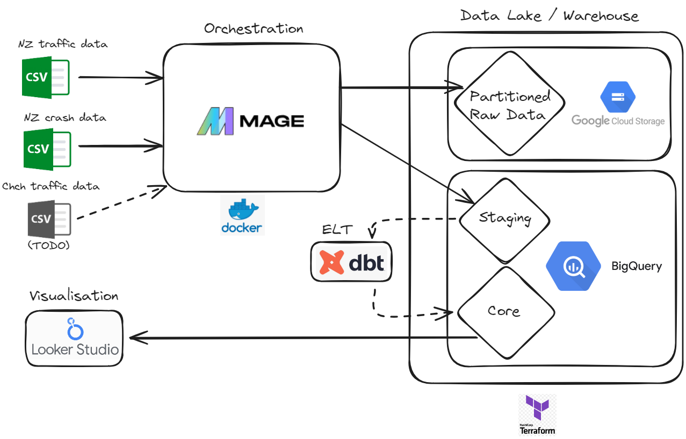

# Christchurch Crash and Traffic Data
This is my 2024 Data Engineering [Zoomcamp](https://github.com/DataTalksClub/data-engineering-zoomcamp) capstone project, consisting of New Zealand Crash Data joined with New Zealand Traffic Data.

Tools used: **Docker, Terraform, Mage, dbt, Google Cloud Platform (BigQuery, GCS, and Looker)**

## Problem Statement
For my data engineering course project, I wanted to combine two data sets:

 1) [NZ Crash Data from the Crash Analysis System (CAS)](https://catalogue.data.govt.nz/dataset/crash-analysis-system-cas-data5). The dataset contains information from New Zealand's crashes from 1-January-2000, and is updated monthly. It is curated by Waka Kotahi - the NZ Transport Agency. 

 2) [TMS (Traffic Management System) daily traffic counts](https://opendata-nzta.opendata.arcgis.com/datasets/9cb86b342f2d4f228067a7437a7f7313). Also by Waka Kotahi, this data set consists of *daily-updated traffic volumes from state highway count sites, by vehicle type.*

Combining these two datasets is the first step. Further downstream, I would like to create a daily-updated map similar to [one made by Road Safety Risk](https://roadsafetyrisk.co.nz/maps/heat-maps#Canterbury) (not updated since 2016), and highlight dangerous sections of **Christchurch** specifically by crashes per unit traffic. See [To-do](#to-do) below for more details.

*Note: Click image to view in Looker Studio*

***

  - [Problem Statement](#problem-statement)
  - [Project Overview](#project-overview)
    - [Prerequisites](#prerequisites)
    - [Instructions](#instructions)
  - [Repository Structure](#repository-structure)
    - [Docker Code](#docker-code)
    - [Terraform Code](#terraform-code)
    - [Mage Code](#mage-code)
    - [dbt Code](#dbt-code)
  - [To-do](#to-do)
  - [Contact](#contact)

## Project Overview

### Prerequisites
- Install [Docker](https://www.docker.com/products/docker-desktop/).
- Install [Terraform](https://developer.hashicorp.com/terraform/install).
- Create a [Google Cloud](https://cloud.google.com/?hl=en) project.
- Create a [Service Key](https://cloud.google.com/iam/docs/keys-create-delete) renaming it `christchurch_service_account.json`, with permissions:
  - `BigQuery Admin`,
  - `Storage Admin`, and
  - `Compute Admin`.
- Move it to `christchurch-crash-data/[SERVICE_KEY]`.
- [Download `TMS_traffic_counts.csv`](https://opendata-nzta.opendata.arcgis.com/datasets/9cb86b342f2d4f228067a7437a7f7313). Move to `christchurch-crash-data/[CSV]`.

### Instructions

See [INSTRUCTIONS.md](INSTRUCTIONS.md).

***

## Repository Structure

- ### Docker Code
  - `docker-compose.yml`
  - `Dockerfile`

- ### Terraform Code
  All infrastructure as code (IaC) is contained in:
    - `/terraform`

- ### Mage Code
  All pipelines to move the data from the web/locally to GCP are contained in:
    - `/magic-zoomcamp`, and
    - `/mage_data`
 
  

- ### DBT Code
  All ELT transformation code is contained in:
  - `/dbt`
  - `dbt_project.yml`
  
  

## Input Data Description

  - Consists of two .csv files: `TMS_traffic_counts.csv` (406MB) and `Crash_Analysis_System_(CAS)_data.csv` (219MB).

## Output

The **raw data** is uploaded to two locations:
1) *Google Cloud Storage*, Partitioned by Year. This is to save on compute in case we wish to investigate the raw data with SQL queries such as: `Find number of fatal bicycle crashes in 2016`.
2) *Big Query*, for ELT processing with dbt.

The **processed data** is uploaded as `fact_crashes.sql` in Big Query.
-  It is a table with the columns `year`, `has_bicycle`, `fatal`, and `total_traffic_counts`.

## TO-DO:

- [x] Use Terraform for IaC
  - [ ] Automate Terraform installation with Docker 
- [ ] Integrate [Christchurch's Traffic Count Data](https://drive.google.com/drive/folders/1dJXE9XieHTazo1JUo67h8M0rPMYl7gZe). This is a collection of spreadsheets created [by the Christchurch City Council](https://ccc.govt.nz/transport/improving-our-transport-and-roads/traffic-count-data), which contains traffic count data for several key intersections in Christchurch. While NZ crash data has [already](https://roadsafetyrisk.co.nz/maps/heat-maps#Canterbury) been combined and and mapped with traffic data by roadsafetyrisk.co.nz, it does not include local road data (from the council).
  - [ ] Somehow merge this city-wide dataset with the state-wide data.
  - [ ] Filter to just Christchurch
- [ ] Add Testing and CI/CD
- [ ] Automatically pull data, with daily updates.
- [ ] Create a web-interface to browse the data.
  - [ ] Visualize crash risk *per unit traffic*.
- [ ] Use Mage to orchestrate dbt

## Contact

If you have any questions, feedback, or issues with the repository, please feel free to reach out to us using the following channels:

- **Email**: pkanewilliams@gmail.com
- **LinkedIn**: [Kane Williams](https://www.linkedin.com/in/kane-williams01/)

